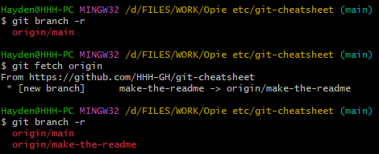
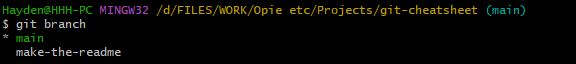
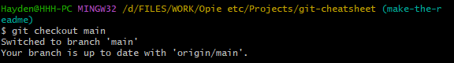
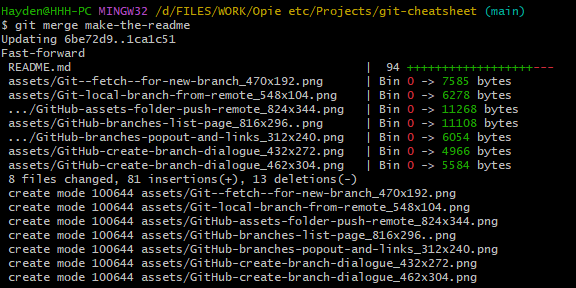
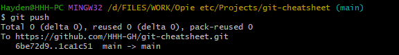
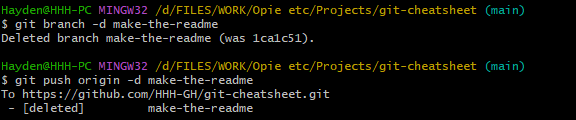
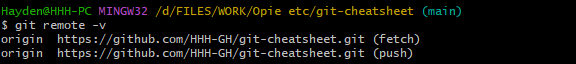
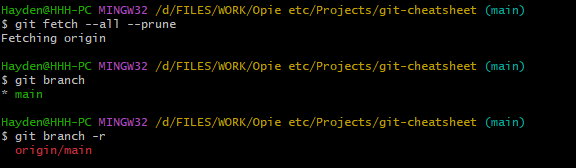

# Git Cheatsheet

Currently mostly about adding existing code into a GitHub repository to start using source control.

July 26, 2023

Right now this cheatsheet covers the steps to do some extremely basic things with Git on the command line, using GitHub as the remote host. It’s overly detailed because I’m trying to learn the details.

Use case: you’re (\*ahem\*) just starting to learn about using Git to collaborate on software development and you plan to familiarise yourself with that by putting your own code into GitHub and messing about with it.

**Contents so far**  
- [Add existing code to a new GitHub repository](#add-existing-code-to-a-new-github-repository)
- [Make a new branch to work with](#make-a-new-branch-to-work-with)
- [Merge your feature branch into main branch, delete the feature branch](#merge-your-feature-branch-into-your-main-branch-and-delete-the-feature-branch-afterwards)
- [Amending a commit](#amending-a-commit)

(This cheatsheet will be updated as [if?] I learn more of the various Git commands and workflows. I’ve used these steps to set up this `README.md`.)

I’m using Git Bash as the terminal app on the Windows side of my computer, and I also use whichever terminal app it is that comes with [Ubuntu on WSL2](https://ubuntu.com/tutorials/install-ubuntu-on-wsl2-on-windows-10#1-overview). My Git install was from [https://git-scm.com/](https://git-scm.com/).

---

## Add existing code to a new GitHub repository

### 1. Make a new repository on GitHub

On your GitHub homepage, click into Repositories and then click the ‘New’ button. (There’s also an option to make a new branch in the little dropdown that shows all the branches.)

- Choose a name for your new repository and (optionally) add a description.
- Choose a Public or Private repository.
- Skip the step that adds a `README` file, a `.gitignore` file, and a `LICENSE` file.


On the next page you’ll see a page with information about your new repository. Keep this page open so you can copy-paste from it in step 4 of this process. You’ll see something like the screenshot here.


### 2. Generate a GitHub Personal access token

You’ll use the token instead of a password. It’s a long string of text that looks like a complicated password. The token grants access to the repository, and it has an expiry date.

Log in at GitHub, go to the [Settings > Developer Settings > Personal access tokens page](https://github.com/settings/tokens), and click the ‘Generate new token’ button.

- Write a note about the purpose of this particular token.
- In the section titled ‘Select scopes’, select the ‘repo’ scope.
- Click the ‘Generate token’ button.
- The token will be displayed on the next page. Copy the token into your password manager, or leave the page open so you can copy-paste the token in step 5 of this process.


### 3. Set up the local folder as a Git repository

Set up the local folder to be tracked by Git.

#### 3a. Initialise the local repository

If your code is stored in a folder named `git-cheatsheet`, open a terminal/prompt in that folder.

The following command initialises a Git repository with a branch named `main`. (You could call the branch whatever you like, but let’s stick with common practice.)

```
git init -b main
```

#### 3b. Configure your user name and email address for the new repository

When you push commits from your local repository to the remote repository, the user name and email address you enter here will be recorded as the author of the changes. (You can add the `--global` flag to set the user name and email address for all repositories on your computer as well, if you’re going to be using the same info for all of your projects.)

```
git config user.name "HHH-GH"
git config user.email "EMAIL ADDRESS HERE"
```

The following command lists the current configuration settings.

```
git config --list
```

Type `q` to exit the list. (sometimes `:q`)

#### 3c. Create your .gitignore, README.md, and LICENSE.md files, if needed

The `.gitignore` file tells Git which files to exclude from source control. I’ve often kept old copies of code in a folder named `old`. Those old copies can be excluded from source control with a line like this in the `.gitignore` file. (See the [Git SCM docs for more on gitignore](https://git-scm.com/docs/gitignore).)

```
# Ignore anything in the 'old' directory
old/
```

`README.md` is usually an introduction to the project and some notes on how it all works. (Optional but recommended)

`LICENSE.md` is a license for use of the code. (Optional)

#### 3d. Add all the files and do a first commit

Add all the files to start tracking them in source control.

```
git add .
```

Make a first commit.

```
git commit -m "First commit"
```

The `-m` flag means ‘use the text inside the quotes as the commit message’. The commit message should describe any changes made to the files being committed. Leave off the `-m` flag, and Git will open a text editor in which you can write a longer commit message.

### 4. Add the remote GitHub repository as the origin for this repository

On the GitHub website page from step 1 you’ll find the https address for the remote repository. We’re going to link our local repository to that remote repository.

Copy the address of the remote repository and add it as the remote origin for the local repository with the following command. (We’re using my Git Cheatsheet repository for this example.)

```
git remote add origin https://github.com/HHH-GH/git-cheatsheet.git
```

Type `git remote -v` to list the remotes for the local repository, if you’re interested. The `-v` flag means ‘be verbose with the info returned’.


### 5. Copy all the branch info to the main branch

```
git branch -M main
```

The `-M` flag forces the move of the local repository’s config and <abbr title="Reference Log">reflog</abbr>. The command above is taking the updated config info added since step 3a, and using it to overwrite any of the previous info for the main branch. (Or something like that—see the explanation of the `-f` and `-M` flags in [the docs for git-branch](https://git-scm.com/docs/git-branch).)

(I’m assuming this only needs to be done this one time.)

### 6. Push the code in the local repository to GitHub

Send the code in your local repository up to the remote repository on GitHub.

You’ll be asked for a password. Use the Personal access token from step 2.

```
git push -u origin main
```

The `-u` flag means ‘add upstream (tracking) references’, according to the [docs for git-push](https://git-scm.com/docs/git-push). It sets the ‘upstream branch for the given branch’, so you can use `git push` and `git pull` and `git fetch` without the extra arguments like `origin main`.

(I’m assuming this also only needs to be done one time per branch.)


### 7. Take a look at the results

The files in the local repository will now also be in the remote repository on GitHub.

---

## Make a new branch to work with

Instead of working directly on the `main` branch, copy the `main` branch to a new ‘feature’ branch and make changes to that new branch. If the changes work, merge the changes into the `main` branch and then delete the feature branch. If your changes to the feature branch break everything irreparably you can delete it and start fresh, instead of trying to rewind a whole lot of commits on your `main` branch.

### 1. Use GitHub to make a new branch

You can also do this on the command line. Using GitHub is easy mode.

- Click any of the ‘New branch’ buttons in your GitHub
- Give the branch a name that describes what it’s for e.g. `make-the-readme`
- Choose the source of the new branch i.e. `main`


### 2. Bring the new branch into your local repository

#### 2a. Get updates from the remote repository

```
git fetch origin
```

The screenshot below shows the results of the `git branch -r` command before and after `git fetch`.



#### 2b. Check that the new branch is available

```
git branch -r
```

The `git branch` command shows the local branches. Adding the `-r` flag shows the remote branches. At this point, if you run `git branch` you won’t see the new branch in your local repository.

#### 2c. Make a local copy of the new branch

```
git checkout -b make-the-readme origin/make-the-readme
```

The screenshot below shows that we’re now working with a local copy of `make-the-readme`.


Now if you run `git branch` you’ll see your local repository has a copy of that new branch for you to work with.

Do your work and then …

### 3. Send any updated files up to the remote repository

Push updated files to the remote repository after you’ve added and committed them.

```
git push
```

Did it work? View the new branch on GitHub to see if your changes have been synced.


###  4. Bonus: use the command line to make a local branch and send it to the remote repository

(If you are not the owner of the remote repository you’ll need to be added as a contributor by the owner before you can do this.)

In this example a branch named `readme-updates` is created using the `main` branch as a base, and then pushed to the remote repository.

```
git checkout -b readme-updates origin/main
git push -u origin readme-updates
```

The -u flag is being used to add upstream tracking references.

---

## Merge your feature branch into your main branch, and delete the feature branch afterwards

To bring changes from a feature branch into your main branch use the `git merge` command on the command line, or do a Pull Request on GitHub.

### 1. Remind yourself of the branch names

```
git branch
```



### 2. Checkout the main branch, and make sure it is up to date

`git fetch` and `git pull` are used to get the most up to date version into your local repository. 

Checkout the branch that you will merge into. (This example will merge `make-the-readme` into `main`)

```
git checkout main
```



### 3. Merge it

```
git merge make-the-readme
```



That was a merge where everything went smoothly. 

### 4. Push the updated version of main up to the remote repository

```
git push
```



Did it work? View the updated branch on GitHub to see if your changes have been synced.

### 5. Delete the feature branch

The feature branch is no longer needed. Delete it from your local and remote repositories.

#### 5a. Delete the feature branch from the local repository

```
git branch -d make-the-readme
```

#### 5b. Delete the feature branch from the remote repository

```
git push origin -d make-the-readme
```



In the preceding command, `origin` is the name of the remote repository. Use the `git remote -v` command to confirm that if needed.



#### 5c. Update your lists of branches

```
git fetch --all --prune
```

#### 5d. Check the local and remote lists of branches

```
git branch
git branch -r
```



The changes made on the feature branch have been merged into main, and the feature branch has been deleted. 

## Amending a commit

Use this if you forgot to include a file in a commit, or if you spotted a typo just after you made a commit. 

```
git add .	// After you've fixed the typo
git commit --amend --no-edit
```

The `--amend` option adds the changes to the previous commit.  
The `--no-edit` option prevents Git opening the previous commit message for edits.

If you do this after pushing the commit to the remote repository you’ll probably have to fix conflicts because ‘the tip of your current branch is behind its remote counterpart’. And you’ll end up with an extra commit message anyway. Is this why the experts say ‘Don’t do this if you have already pushed your changes’? Maybe yes? So if you spot a typo and you’ve already pushed the commit, you might as well do a new commit with a commit message like `typo lol` instead of something like `Merge branch '42-wechat-posts-auto-generated-qr-code' of https://github.com/HHH-GH/bjh-ee-site-templates into 42-wechat-posts-auto-generated-qr-code`.

---

## References

The ‘Add existing code to a new GitHub repository’ part of this document is based on:

- GitHub’s [Adding locally hosted code to GitHub docs](https://docs.github.com/en/get-started/importing-your-projects-to-github/importing-source-code-to-github/adding-locally-hosted-code-to-github#adding-a-local-repository-to-github-using-git) (github.com)
- Karl Broman’s [Start a new git repository guide](https://kbroman.org/github_tutorial/pages/init.html) (kbroman.org)
